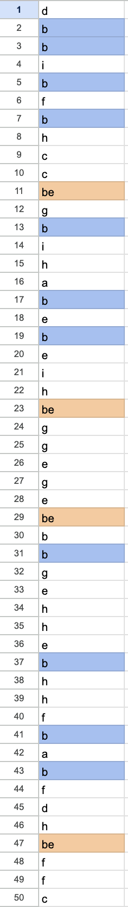
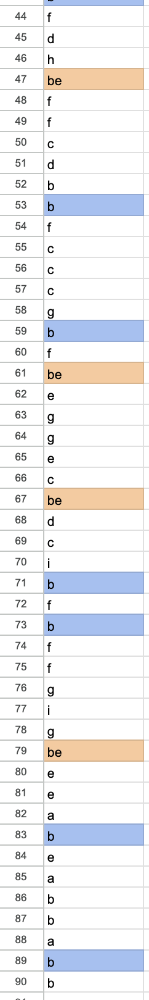
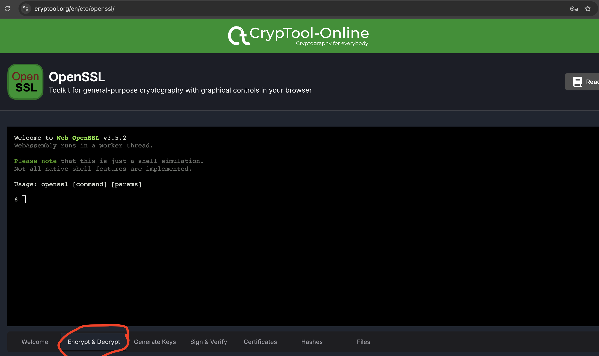
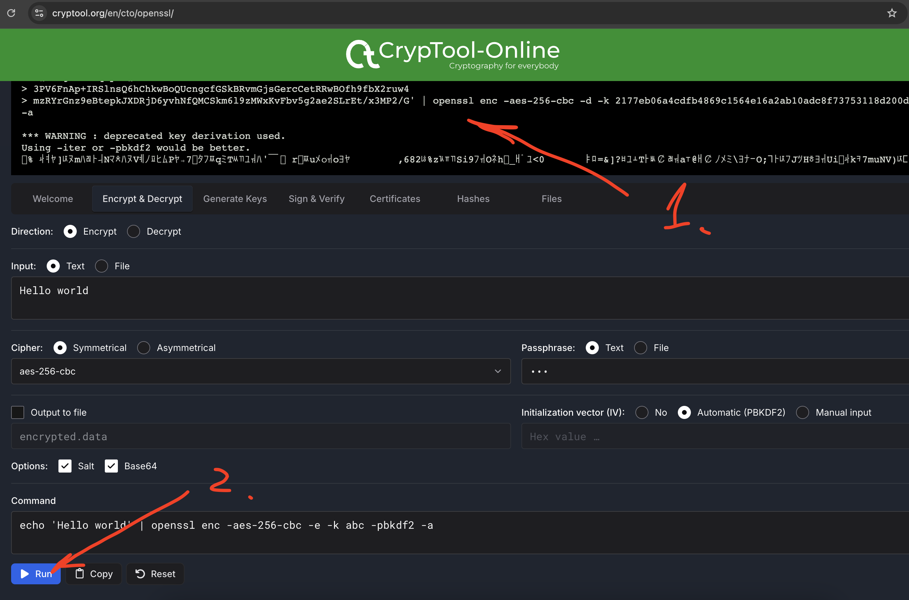

# Cosmic duality and SalPhaseIon reproducible solution

## Reproducible solution

Password is made of two halves (the half and better half).

## First half

We start by combining first half of password from pieces of "SalPhaseIon" stage:

### First piece: Yellow and blue primes

We see the following string:
```
dbbibfbhccbegbihabebeihbeggegebebbgehhebhhfbabfdhbeffcdbbfcccgbfbeeggecbedcibfbffgigbeeeabe
```

You can easily check, that in prime number positions (2, 3, 5, 7, 11, ...) there is always either `B` character (short for Blue) or `BE` characters (BE -> 25 -> Y is short for Yellow).





Therefore the very first part of our password is:
```
yellowblueprimes
```

### Second piece: Matrix sum list

Next we see the following string:
```
abbabbababbaaaababbbabaaabbbaabaabbabaababbbbaaaabbbaabbabbbabababbabbababbabbaaabbabaababbbaabbabbbabaa
```

It is decoded easily as:
substitute a -> 0 , b -> 1
then convert binary to ASCII

[Example flow](https://gchq.github.io/CyberChef/#recipe=Substitute('ab','01',false)From_Binary('Space',8)&input=YWJiYWJiYWJhYmJhYWFhYmFiYmJhYmFhYWJiYmFhYmFhYmJhYmFhYmFiYmJiYWFhYWJiYmFhYmJhYmJiYWJhYmFiYmFiYmFiYWJiYWJiYWFhYmJhYmFhYmFiYmJhYWJiYWJiYmFiYWE)

Resulting piece of password is:
```
matrix sum list
```


### Third piece: Last words before archi choice

Next we see the following string:
```
agdafaoaheiecggchgicbbhcgbehcfcoabicfdhhcdbbcagbdaiobbgbeadedde
```

[Decode flow](https://gchq.github.io/CyberChef/#recipe=Remove_whitespace(true,true,true,true,true,false)Substitute('abcdefghio','1234567890',false)To_Base(16)From_Hex('Auto')&input=YSBnIGQgYSBmIGEgbyBhIGggZSBpIGUgYyBnIGcgYyBoIGcgaSBjIGIgYiBoIGMgZyBiIGUgaCBjIGYgYyBvIGEgYiBpIGMgZiBkIGggaCBjIGQgYiBiIGMgYSBnIGIgZCBhIGkgbyBiIGIgZyBiIGUgYSBkIGUgZCBkIGU)


Last words before archi choice is an Architect speech:
Resulting piece of password is:
```
hope it is the quintessential human delusion
```


### Fourth piece: This password

Next we see the following string:
```
cfobfdhgdobdgooiigdocdaoofidh
```

[Decode flow](https://gchq.github.io/CyberChef/#recipe=Remove_whitespace(true,true,true,true,true,false)Substitute('abcdefghio','1234567890',false)To_Base(16)From_Hex('Auto')&input=YyBmIG8gYiBmIGQgaCBnIGQgbyBiIGQgZyBvIG8gaSBpIGcgZCBvIGMgZCBhIG8gbyBmIGkgZCBo)

Fourth piece of password is:
```
thispassword
```


## Final first half of password

Combining previous pieces we get:
```
yellowblueprimesmatrix sum listhope it is the quintessential human delusionthispassword
```

## First hash

Right after this we see "shabef" which means "SHA256", therefore we should calculate SHA sum of a previous puzzle pieces.

[The flow](https://gchq.github.io/CyberChef/#recipe=SHA2('256',64,160)&input=eWVsbG93Ymx1ZXByaW1lc21hdHJpeCBzdW0gbGlzdGhvcGUgaXQgaXMgdGhlIHF1aW50ZXNzZW50aWFsIGh1bWFuIGRlbHVzaW9udGhpc3Bhc3N3b3Jk)

Result is:
```
9489cd74ffafb8e409840a1b8656d3f462602f6748264bcdd929240abb907e12
```

## Second half

### Fifth piece: Our first hint

Next we see the following string:
```
ourfirsthintisyourlastcommand
```

First puzzle author's hint was: Follow the white rabbit
First puzzle author's hint was: Hash the text

Fifth piece of password is:
```
followthewhiterabbit
```

### Last piece: Enter

Next we see the following string:
```
abbaabababbabbbaabbbabaaabbaabababbbaaba
```

It is decoded easily as:
substitute a -> 0 , b -> 1
then convert binary to ASCII

[Example flow](https://gchq.github.io/CyberChef/#recipe=Substitute('ab','01',false)From_Binary('Space',8)&input=YSBiIGIgYSBhIGIgYSBiIGEgYiBiIGEgYiBiIGIgYSBhIGIgYiBiIGEgYiBhIGEgYSBiIGIgYSBhIGIgYSBiIGEgYiBiIGIgYSBhIGIgYQ)


Therefore the very last part of our password is:
```
enter
```

### To hash or not to hash

The very last part of a password (now seriourly) is a hash. It's the actual hash (or sharp) character:
```
#
```

## Final second half of password

Combining hash of a first part and remaining password pieces we get:
```
9489cd74ffafb8e409840a1b8656d3f462602f6748264bcdd929240abb907e12followthewhiterabbitenter#
```

## Final hash

Once again right after this we see "shabefanstoo" which means "SHA256 answer too", therefore we should calculate SHA sum of a previous puzzle pieces, emplaced after the first hash:

[The flow](https://gchq.github.io/CyberChef/#recipe=SHA2('256',64,160)&input=OTQ4OWNkNzRmZmFmYjhlNDA5ODQwYTFiODY1NmQzZjQ2MjYwMmY2NzQ4MjY0YmNkZDkyOTI0MGFiYjkwN2UxMmZvbGxvd3RoZXdoaXRlcmFiYml0ZW50ZXIj)

Result is:
```
9ee1389fde2d19d2bb7e5a26e5797b485566dc6f0e94a7de5aefef45d8775b51
```

# Crack the OpenSSL of Cosmic Duality

Now all we need to do is to run this command:

```
echo 'U2FsdGVkX18tP2/gbclQ5tNZuD4shoV3axuUd8J8aycGCAMoYfhZK0JecHTDpTFe
dGJh4SJIP66qRtXvo7PTpvsIjwO8prLiC/sNHthxiGMuqIrKoO224rOisFJZgARi
c7PaJPne4nab8XCFuV3NbfxGX2BUjNkef5hg7nsoadZx08dNyU2b6eiciWiUvu7D
SATSFO7IFBiAMz7dDqIETKuGlTAP4EmMQUZrQNtfbJsURATW6V5VSbtZB5RFk0O+
IymhstzrQHsU0Bugjv2nndmOEhCxGi/lqK2rLNdOOLutYGnA6RDDbFJUattggELh
2SZx+SBpCdbSGjxOap27l9FOyl02r0HU6UxFdcsbfZ1utTqVEyNs91emQxtpgt+6
BPZisil74Jv4EmrpRDC3ufnkmWwR8NfqVPIKhUiGDu5QflYjczT6DrA9vLQZu3ko
k+/ZurtRYnqqsj49UhwEF9GfUfl7uQYm0UunatW43C3Z1tyFRGAzAHQUFS6jRCd+
vZGyoTlOsThjXDDCSAwoX2M+yM+oaEQoVvDwVkIqRhfDNuBmEfi+HpXuJLPBS1Pb
UjrgoG/Uv7o8IeyST4HBv8+5KLx7IKQS8f1kPZ2YUME+8XJx0caFYs+JS2Jdm0oj
Jm3JJEcYXdKEzOQvRzi4k+6dNlJ05TRZNTJvn0fPG5cM80aQb/ckUHsLsw9a4Wzh
HsrzBQRTIhog9sTm+k+LkXzIJiFfSzRgf250pbviFGoQaIFl1CTQPT2w29DLP900
6bSiliywwnxXOor03Hn+7MJL27YxeaGQn0sFGgP5X0X4jm3vEBkWvtF4PZl0bXWZ
LvVL/zTn87+2Zi/u7LA6y6b2yt7YVMkpheeOL0japXaiAf3bSPeUPGz/eu8ZX/Nn
O3259hG1XwoEVcGdDBV0Nh0A4/phPCR0x5BG04U0OeWAT/5Udc/gGM0TT2FrEzs/
AJKtmsnj31OSsqWb9wD+CoduYY2JrkzJYihE3ZcgcvqqffZXqxQkaI/83ro6JZ4P
ubml0PUnAnkdmnBCpbClbZMzmo3ELZ0EQwsvkJFDMQmiRhda4nBooUW7zXOIb7Wx
bE9THrt3cdZP5uAgVfgguUNE4fZMN8ATEDhdSsLklJe2GvihKuZVA6uuSkWAsK6u
MGo76xpPwYs3eUdLjtANS83a6/F/fhkX1GXs7zbQjh+Inzk8jhEdEogl9jPs/oDj
KjbkUpFlsCWwAZGoeKlmX7c4OGuD5c+FEH+2nYHvYl8y1E/K5SDt9Uocio8XuxbD
ZOzhw7LMSGkD1MZxpDzsCZY1emkSNd88NFj+9U8VssIDDVMYwKMsHKfjc0x5OlzQ
1f6ST0xCkwydDHHGRKKxFC4y6H6fV9sgf9OPK/65z94Rx72+mfvTyizShjxYSRpl
sH9otU4parl8roD0KsVTfXZoYrYXzK6cXBn1BO/OEqWlu++Dd9MiGaUGKd22fXER
qNWoRAKlNn2b6EehD2D8WaAoliPURjkB0Lb/FpP9unI93Twg6NxBXAj734nctukR
b3kE08RydJV70eJsvEftF5hbED4HacGx9pzisaSz6t9AKiuSoF6uoCtlTIYatyfZ
kQA4wg50hAJqTynOQ09ArRHEchtB/7uvWZSBGJ7+zlzRGKx99P3oDZD+Y5D8bmUs
3PV6FnAp+IRSlnsQ6hChkwBoQUcngcfGSkBRvmGjsGercCetRRwBOfh9fbX2ruw4
mzRYrGnz9eBtepkJXDRjD6yvhNfQMCSkm6l9zMWxKvFbv5g2ae2SLrEt/x3MP2/G' | openssl enc -aes-256-cbc -d -k 9ee1389fde2d19d2bb7e5a26e5797b485566dc6f0e94a7de5aefef45d8775b51 -a
```

You can easily check this in your terminal or with this [online tool](https://www.cryptool.org/en/cto/openssl/)

You would need to select "Encrypt & Decrypt" tab:


Then paste command from the box above into terminal simulation and hit "Run":


You will see, that there is no "Bad Decrypt" error reported by OpenSSL.

## The Warning

 ⚠️⚠️⚠️ Warning: This is not actual solution for mentioned stages, it's made for educational purposes! ⚠️⚠️⚠️

The idea behind this repo (and few others, that you can find in my profile) is to demonstrate, that you can get a lot of "keys" or "passwords" that look reasonable at first glance and even wouldn't produce any "Bad decrypt" errors when you pass them to openssl to decode "Cosmic Duality" or any other GSMG puzzle stage. But the only fact, that OpenSSL reports success DOES NOT MEAN that you actually decoded anything successfully or made any progress at all.

My previous explanation of what is actually happening you can find here:
[OpenSSL for restless souls](https://huggingface.co/spaces/CoruNethron/openssl-for-restless-souls)

## Donations

TRC20:
```
TW9aR2wmMoX1KAfFhBbm1WkDHAtJf1eXYp
```

BTC:
```
1mnhfmrcpzbJPpqRX7aPiW4mGgN5WqnXX
```

TON:
```
UQCNhbN-9r0gNJgtaiIt-bs9nIR4Dpl-Ncts3l9S4Atnat_e
```

Sber (Russia):


